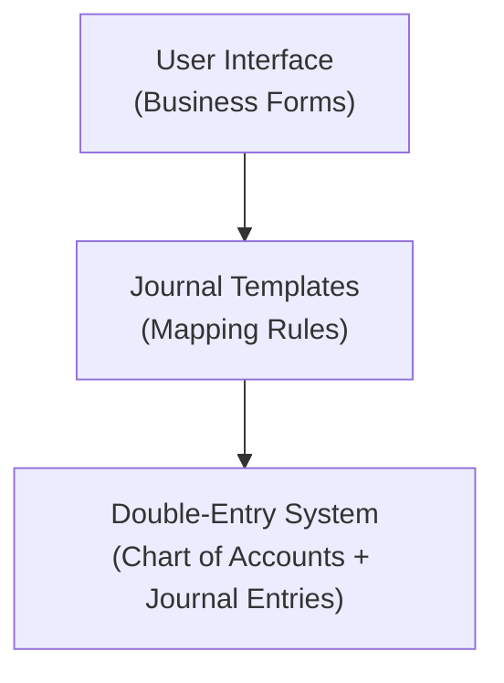
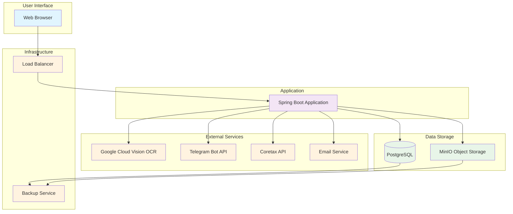

# Architecture

## System Overview

Indonesian accounting application for small businesses, built with Spring Boot 4.0 and designed specifically for Indonesian tax compliance and business regulations.

### Current Status
- **Phase 0-3 Complete**: Core Accounting, Tax Compliance, Payroll & RBAC
- **Production Ready**: Full E2E testing, deployment automation, and documentation
- **Indonesian Focused**: Built specifically for Indonesian business requirements

## Technology Stack

### Backend
- **Java 25** with Spring Boot 4.0
- **PostgreSQL 17** with Flyway migrations
- **Spring Data JPA** for data access
- **Spring Security** with method-level RBAC
- **Apache POI** for Excel exports
- **OpenPDF** for PDF generation
- **Google Cloud Vision** for OCR

### Frontend
- **Thymeleaf** server-side templating
- **HTMX** for dynamic interactions
- **Alpine.js** for client-side reactivity
- **Bootstrap** with responsive design
- **Tailwind CSS** for utility styling

### DevOps & Testing
- **Maven** build system with JaCoCo coverage
- **Testcontainers** for PostgreSQL testing
- **Playwright** for E2E functional tests
- **Pulumi** for infrastructure as code
- **Ansible** for configuration management

## Architecture Patterns

### 1. Transaction-Centric Design

The application uses a transaction-centric approach where users describe business events rather than understanding debits/credits directly.



**Example: Paying electricity bill**
- User sees: "Expense Payment" form with amount, category, payment account
- System generates: Debit Beban Listrik, Credit Bank Account

### System Architecture Overview



### 2. Single-Tenant Deployment

Each company gets its own isolated instance and database:

```
Control Plane
├── Instance A (Company 1)
│   ├── PostgreSQL Database
│   └── Spring Boot Application
├── Instance B (Company 2)
│   ├── PostgreSQL Database
│   └── Spring Boot Application
└── Instance C (Company 3)
    ├── PostgreSQL Database
    └── Spring Boot Application
```

**Benefits:**
- Complete data and process isolation
- No multi-tenancy code complexity
- Simpler compliance and security
- Independent scaling per client

## Application Layers

### 1. Controller Layer (`src/main/java/.../controller/`)
- **25+ controllers** handling business domains
- RESTful design with proper HTTP mappings
- Global exception handling
- Method-level security annotations
- HTMX integration for dynamic updates

**Key Controllers:**
- `DashboardController` - KPI and reporting
- `TransactionController` - All journal entry CRUD operations (create, edit, post, void)
- `JournalEntryController` - Ledger views only (General Ledger, Account Ledger)
- `JournalTemplateController` - Template configuration
- `PayrollController` - Payroll processing
- `TaxReportController` - Indonesian tax compliance

### 2. Service Layer (`src/main/java/.../service/`)
- Business logic implementation
- Transaction management with Spring
- Complex Indonesian calculations (BPJS, PPh 21, payroll)
- Template execution with formula processing
- Document processing and OCR integration

**Key Services:**
- `JournalService` - Double-entry bookkeeping
- `FormulaService` - SpEL-based calculations
- `Pph21Service` - Indonesian PPh 21 calculations
- `PayrollService` - Payroll processing
- `OcrService` - Receipt processing

### 3. Repository Layer (`src/main/java/.../repository/`)
- Spring Data JPA repositories
- Custom queries for complex reporting
- Optimized indexing strategies
- Soft delete patterns

### 4. Entity Layer (`src/main/java/.../entity/`)
- **40+ JPA entities** with proper relationships
- Comprehensive audit fields
- Indonesian-specific business rules
- UUID primary keys throughout

## Data Model Architecture

### Core Accounting Structure

**Transaction-Centric Architecture:**
All journal entries are created through transactions. There are no standalone journal entries.

```sql
-- Transaction as header for journal entries
transaction (UUID primary key)
├── journal_entries[] (multiple debit/credit entries, transaction_id NOT NULL)
├── journal_template (mapping rules for generating entries)
└── account_mappings (user-selected accounts for template placeholders)

-- Chart of accounts
chart_of_account (hierarchical structure)
├── account_type (Asset, Liability, Equity, Revenue, Expense)
└── normal_balance (Debit/Credit)
```

**System Templates vs User Templates:**
- System templates (9 total): Used by internal modules (PayrollService, FixedAssetService, FiscalYearClosingService)
- User templates: Industry-specific templates that users can customize

### Extended Features
```sql
-- Project management
project
├── project_milestones
├── project_transactions
└── project_profitability

-- Payroll system
employee
├── salary_components (17 Indonesian components)
├── payroll_runs
└── payroll_details

-- Tax compliance
fiscal_period
├── tax_deadlines
├── tax_transaction_details
└── coretax_export_data
```

### Indonesian Tax Compliance
- **e-Faktur** support for PPN transactions
- **e-Bupot** support for PPh 23 withholding
- **Fiscal period** management with monthly closing
- **Tax deadline** tracking and notifications
- **Coretax** export integration

## Security Architecture

### Authentication & Authorization
- **Spring Security** with BCrypt password encryption
- **RBAC** with 6 predefined roles:
  1. `SUPERADMIN` - System administration
  2. `OWNER` - Full company access
  3. `ACCOUNTANT` - Accounting operations
  4. `BOOKKEEPER` - Transaction entry
  5. `EMPLOYEE` - Self-service only
  6. `VIEWER` - Read-only access

### Permission System
- **Granular authority-based** access control
- **Method-level security** annotations
- **Self-service isolation** for employee data
- **CSRF protection** integrated with HTMX

## Frontend Architecture

### Template System
- **Thymeleaf** with layout dialect
- **HTMX** for partial page updates
- **Alpine.js** for reactive components
- **Bootstrap** responsive design

### Key UI Patterns
```html
<!-- Dynamic table updates with HTMX -->
<table>
  <tbody hx-get="/transactions" hx-trigger="refresh" hx-target="this">
    <!-- Server-rendered content -->
  </tbody>
</table>

<!-- Reactive forms with Alpine.js -->
<form x-data="{ formData: {} }" x-bind:submit.prevent="submitForm">
  <!-- Form fields with Alpine reactivity -->
</form>
```

## Deployment Architecture

### Infrastructure as Code
```typescript
// Pulumi infrastructure
import * as digitalocean from "@pulumi/digitalocean";

const appDroplet = new digitalocean.Droplet("app", {
    image: "docker-20-04",
    region: "sgp1",
    size: "s-2vcpu-4gb", // 4GB RAM
});

const database = new digitalocean.DatabaseCluster("db", {
    engine: "pg",
    version: "17",
    size: "db-s-2vcpu-4gb"
});
```

### Docker Configuration
```yaml
# docker-compose.yml
version: '3.8'
services:
  app:
    image: registry.example.com/akunting:${VERSION}
    ports:
      - "8080:8080"
    environment:
      - SPRING_PROFILES_ACTIVE=production
      - DATABASE_URL=jdbc:postgresql://db:5432/company_db

  db:
    image: postgres:17
    volumes:
      - postgres_data:/var/lib/postgresql/data

  nginx:
    image: nginx:alpine
    ports:
      - "80:80"
      - "443:443"
```

## Feature Implementation

### Phase 1: Core Accounting ✅
- Chart of accounts with hierarchical structure
- Journal template system with formula support
- Double-entry bookkeeping engine
- Basic financial statements (Trial Balance, Income Statement, Balance Sheet)
- Transaction management and reporting

### Phase 2: Tax Compliance ✅
- Indonesian tax calendar integration
- e-Faktur and e-Bupot data export
- Fiscal period management with closing controls
- Tax deadline tracking and notifications
- Coretax API integration for automated filing

### Phase 3: Payroll & RBAC ✅
- Employee management with PTKP status
- 17 preloaded Indonesian salary components
- BPJS calculation engine (Kesehatan, Ketenagakerjaan)
- PPh 21 calculation with progressive rates
- Payroll processing workflow with approvals
- User management with 6-role RBAC system
- Employee self-service portal (payslips, tax documents)

### Advanced Features
- **Project Profitability Tracking**: Track revenue and expenses per project
- **Amortization Schedules**: Asset depreciation with Indonesian methods
- **Document Management**: OCR-based receipt processing
- **Data Import/Export**: Excel-based bulk operations
- **Dashboard KPIs**: Real-time business metrics
- **Telegram Integration**: Mobile expense capture

## Testing Strategy

### Test Coverage Approach
- **Unit Tests**: Service layer with Spring Boot Test
- **Integration Tests**: Controller layer with Testcontainers
- **E2E Tests**: Full browser automation with Playwright
- **Target Coverage**: 80% across all layers

### Test Organization
```
src/test/java/
├── functional/          # Playwright E2E tests
│   ├── ChartOfAccountsTest.java
│   ├── JournalTemplateTest.java
│   └── PayrollTest.java
├── integration/         # Spring Boot tests
├── unit/               # Service layer tests
└── resources/
    ├── db/testmigration/  # Test data fixtures
    └── application-test.properties
```

## Performance Considerations

### Database Optimization
- **Indexing Strategy**: Optimal indexes for common queries
- **Materialized Views**: Complex report generation
- **Connection Pooling**: HikariCP configuration
- **Query Optimization**: N+1 prevention with JOIN FETCH

### Application Performance
- **Virtual Threads**: Java 25 concurrent processing
- **Async Processing**: Heavy reports and exports
- **Caching**: Spring Cache for frequently accessed data
- **Lazy Loading**: JPA relationships optimized

## Monitoring & Observability

### Application Metrics
- **Spring Boot Actuator**: Health checks and metrics
- **JaCoCo**: Code coverage reporting
- **OWASP**: Dependency security scanning
- **Application Logging**: Structured logging with ELK

### Infrastructure Monitoring
- **System Metrics**: CPU, memory, disk usage
- **Database Performance**: Query performance monitoring
- **Backup Monitoring**: Automated backup verification
- **SSL Certificate Monitoring**: Certificate expiry alerts

## Compliance & Data Protection

### Indonesian Tax Compliance
- **10-year Data Retention**: Audit compliance
- **Complete Audit Trail**: Transaction modification tracking
- **Tax Export Formats**: Coretax, e-Faktur, e-Bupot
- **Fiscal Period Controls**: Edit restrictions for closed periods

### Data Security
- **Encrypted Credentials**: Database passwords and API keys
- **Role-Based Access**: Granular permission control
- **Audit Logging**: All user actions logged
- **Regular Backups**: Automated backup and recovery

## Future Architecture Considerations

### Phase 4: Analytics & Reconciliation
- **Advanced Analytics**: Financial trend analysis
- **Bank Reconciliation**: Automated transaction matching
- **Alert System**: Anomaly detection and notifications
- **Custom Reporting**: Report builder with templates

### Scalability Improvements
- **Read Replicas**: Report performance optimization
- **Microservices**: Potential service decomposition
- **Event Sourcing**: Audit trail enhancement
- **API Gateway**: External integration management

This architecture represents a production-ready, comprehensive accounting system specifically designed for Indonesian small businesses, with all planned phases fully implemented, tested, and deployed.