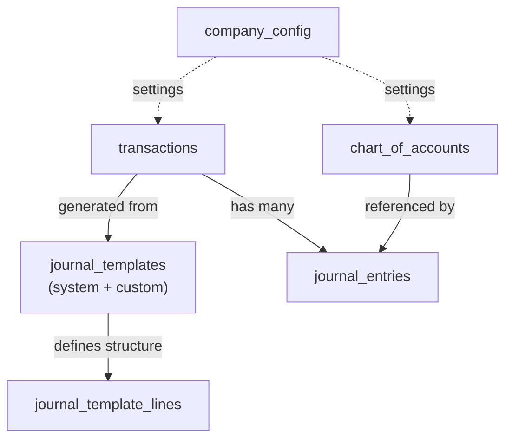
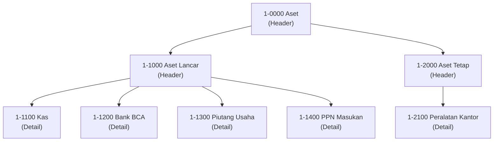
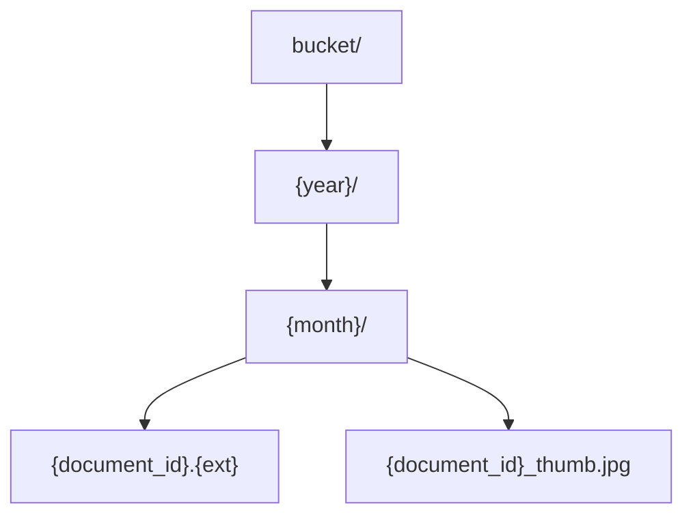

# Database Schema & Data Model

## Entity Relationship Overview



## Core Entities

### 1. Company Configuration (Single-Tenant)

```sql
company_config
- id                    UUID PRIMARY KEY
- name                  VARCHAR(255) NOT NULL
- business_type         VARCHAR(100)           -- 'warung', 'toko', 'jasa', etc.
- npwp                  VARCHAR(20)
- is_pkp                BOOLEAN DEFAULT false  -- PKP status for PPN
- fiscal_year_start     INTEGER DEFAULT 1      -- Month (1-12)
- timezone              VARCHAR(50) DEFAULT 'Asia/Jakarta'
- created_at            TIMESTAMP
- updated_at            TIMESTAMP
```

**Note:** Single-tenant architecture - each application instance serves only one company. No `tenant_id` needed in any table.

### 2. Chart of Accounts

```sql
chart_of_accounts
- id                    UUID PRIMARY KEY
- code                  VARCHAR(20) UNIQUE NOT NULL   -- e.g., "1-1100"
- name                  VARCHAR(255) NOT NULL         -- e.g., "Kas"
- name_en               VARCHAR(255)                  -- Optional English name
- account_type          VARCHAR(20) NOT NULL          -- 'asset', 'liability', 'equity', 'revenue', 'expense'
- parent_id             UUID REFERENCES chart_of_accounts(id)
- level                 INTEGER                       -- Hierarchy level (1, 2, 3...)
- is_header             BOOLEAN DEFAULT false         -- Header vs detail account
- is_active             BOOLEAN DEFAULT true
- description           TEXT
- created_at            TIMESTAMP
- updated_at            TIMESTAMP

INDEX(account_type)
INDEX(parent_id)
```

**Account Types:**
- `asset` - Aset (Harta)
- `liability` - Kewajiban (Hutang)
- `equity` - Ekuitas (Modal)
- `revenue` - Pendapatan
- `expense` - Beban

**Example Hierarchy:**


### 3. Journal Templates

```sql
journal_templates
- id                    UUID PRIMARY KEY
- name                  VARCHAR(255) NOT NULL
- description           TEXT
- category              VARCHAR(50)            -- 'expense', 'income', 'payment', 'transfer', etc.
- is_system             BOOLEAN DEFAULT false  -- System (preloaded) vs user-created
- is_active             BOOLEAN DEFAULT true
- created_by            UUID REFERENCES users(id)
- created_at            TIMESTAMP
- updated_at            TIMESTAMP

INDEX(category, is_active)
INDEX(is_system, is_active)
```

**Categories:**
- `income` - Penerimaan
- `expense` - Pengeluaran
- `payment` - Pembayaran
- `receipt` - Penerimaan Pembayaran
- `transfer` - Transfer Antar Akun
- `tax` - Pajak
- `adjustment` - Penyesuaian
- `closing` - Penutupan

### 4. Journal Template Lines

```sql
journal_template_lines
- id                    UUID PRIMARY KEY
- template_id           UUID NOT NULL REFERENCES journal_templates(id) ON DELETE CASCADE
- line_number           INTEGER NOT NULL       -- Order of lines
- line_type             VARCHAR(10) NOT NULL   -- 'debit' or 'credit'
- account_id            UUID REFERENCES chart_of_accounts(id)  -- NULL if user-selectable
- mapping_key           VARCHAR(100)           -- e.g., "expense_account", "payment_account"
- label                 VARCHAR(255)           -- UI label for user selection
- amount_source         VARCHAR(20) NOT NULL   -- 'transaction_amount', 'fixed', 'percentage', 'formula'
- amount_value          DECIMAL(15,2)          -- For fixed amounts or percentage
- formula               TEXT                   -- For complex calculations
- is_required           BOOLEAN DEFAULT true
- description           TEXT
- created_at            TIMESTAMP

INDEX(template_id, line_number)
```

**Amount Source Types:**
- `transaction_amount` - Use transaction amount * percentage
- `fixed` - Fixed amount (stored in amount_value)
- `percentage` - Percentage of transaction (e.g., 11% for PPN)
- `formula` - Custom formula (e.g., "transaction_amount * 0.11 + 1000")
- `user_defined` - User enters amount manually

**Example Template Lines:**

Template: "Bayar Beban + PPN"
```
Line 1: Debit  | account_id: NULL           | mapping_key: "expense_account"  | amount: 100% | label: "Akun Beban"
Line 2: Debit  | account_id: [PPN Masukan]  | mapping_key: NULL               | amount: 11%  | label: NULL
Line 3: Credit | account_id: NULL           | mapping_key: "payment_account"  | amount: 111% | label: "Dibayar dari"
```

### 5. Transactions

```sql
transactions
- id                    UUID PRIMARY KEY
- template_id           UUID REFERENCES journal_templates(id)
- transaction_number    VARCHAR(50) UNIQUE NOT NULL   -- Auto-generated: TRX-2025-00001
- transaction_date      DATE NOT NULL
- description           TEXT NOT NULL
- reference_no          VARCHAR(100)           -- External reference (invoice no, etc.)
- total_amount          DECIMAL(15,2) NOT NULL -- Base amount (DPP for tax transactions)
- status                VARCHAR(20) DEFAULT 'draft'  -- 'draft', 'posted', 'void'
- metadata              JSONB                  -- Template-specific data
- created_by            UUID REFERENCES users(id)
- posted_by             UUID REFERENCES users(id)
- posted_at             TIMESTAMP
- voided_by             UUID REFERENCES users(id)
- voided_at             TIMESTAMP
- void_reason           TEXT
- created_at            TIMESTAMP
- updated_at            TIMESTAMP

INDEX(transaction_date, status)
INDEX(status)
INDEX(template_id)
```

**Status Values:**
- `draft` - Saved but not posted to ledger
- `posted` - Posted to general ledger
- `void` - Cancelled (soft delete, maintains audit trail)

**Metadata Example (JSONB):**
```json
{
  "customer_id": "uuid",
  "invoice_number": "INV-2025-001",
  "due_date": "2025-02-15",
  "ppn_rate": 0.11,
  "includes_ppn": true
}
```

### 6. Transaction Account Mappings

```sql
transaction_account_mappings
- id                    UUID PRIMARY KEY
- transaction_id        UUID NOT NULL REFERENCES transactions(id) ON DELETE CASCADE
- mapping_key           VARCHAR(100) NOT NULL  -- Matches template line mapping_key
- account_id            UUID NOT NULL REFERENCES chart_of_accounts(id)
- amount                DECIMAL(15,2)          -- NULL means use template calculation
- notes                 TEXT
- created_at            TIMESTAMP

INDEX(transaction_id)
INDEX(account_id)
```

**Purpose:** Links user-selected accounts to template placeholders

**Example:**
```
Transaction: Bayar listrik Rp 1,000,000
Mappings:
- mapping_key: "expense_account"  → account_id: [5-1100 Beban Listrik]
- mapping_key: "payment_account"  → account_id: [1-1200 Bank BCA]
```

### 7. Journal Entries

```sql
journal_entries
- id                    UUID PRIMARY KEY
- transaction_id        UUID REFERENCES transactions(id) ON DELETE RESTRICT
- entry_date            DATE NOT NULL
- account_id            UUID NOT NULL REFERENCES chart_of_accounts(id)
- debit                 DECIMAL(15,2) DEFAULT 0
- credit                DECIMAL(15,2) DEFAULT 0
- description           TEXT
- created_at            TIMESTAMP
- updated_at            TIMESTAMP

INDEX(entry_date)
INDEX(account_id, entry_date)
INDEX(transaction_id)

CONSTRAINT check_debit_or_credit CHECK (
  (debit > 0 AND credit = 0) OR (credit > 0 AND debit = 0)
)
```

**Immutability:** Once posted, journal entries should not be edited. Corrections done via reversal entries.

**Example Journal Entries:**
```
Transaction: TRX-2025-00123
Entry 1: account_id: [5-2100], debit: 1,000,000, credit: 0, description: "Beban Sewa Kantor"
Entry 2: account_id: [1-1400], debit:   110,000, credit: 0, description: "PPN Masukan"
Entry 3: account_id: [1-1200], debit:         0, credit: 1,110,000, description: "Bank BCA"
```

### 8. Account Balances (Materialized)

```sql
account_balances
- id                    UUID PRIMARY KEY
- account_id            UUID NOT NULL REFERENCES chart_of_accounts(id)
- period_year           INTEGER NOT NULL
- period_month          INTEGER NOT NULL       -- 1-12
- opening_balance       DECIMAL(15,2) DEFAULT 0
- debit_total           DECIMAL(15,2) DEFAULT 0
- credit_total          DECIMAL(15,2) DEFAULT 0
- ending_balance        DECIMAL(15,2) DEFAULT 0
- updated_at            TIMESTAMP

UNIQUE(account_id, period_year, period_month)
INDEX(period_year, period_month)
```

**Purpose:** Pre-aggregated balances for fast report generation

**Calculation:**
```
ending_balance = opening_balance + debit_total - credit_total  (for asset/expense)
ending_balance = opening_balance - debit_total + credit_total  (for liability/equity/revenue)
```

## Supporting Entities

### 9. Users

```sql
users
- id                    UUID PRIMARY KEY
- email                 VARCHAR(255) UNIQUE NOT NULL
- password_hash         VARCHAR(255) NOT NULL
- full_name             VARCHAR(255) NOT NULL
- role                  VARCHAR(50) NOT NULL   -- 'owner', 'operator', 'power_operator', 'viewer', 'auditor'
- is_active             BOOLEAN DEFAULT true
- created_at            TIMESTAMP
- updated_at            TIMESTAMP
- last_login_at         TIMESTAMP
```

### 10. User Roles (Simplified for Single-Tenant)

**Note:** In single-tenant architecture, role management is simplified. Each application instance has its own user base.

User roles are stored directly in the `users` table. For time-bound access (auditors), additional fields are included:

```sql
-- Additional fields in users table for time-bound access
users (additional fields)
- access_start_date     DATE                   -- For time-bound access (auditor)
- access_end_date       DATE                   -- For time-bound access (auditor)
- granted_by            UUID REFERENCES users(id)

INDEX(access_end_date) WHERE role = 'auditor'
```

**Purpose:** Simple role-based access within the single company instance

### 11. Audit Log

```sql
audit_logs
- id                    UUID PRIMARY KEY
- user_id               UUID REFERENCES users(id)
- entity_type           VARCHAR(100) NOT NULL  -- 'transaction', 'journal_entry', etc.
- entity_id             UUID NOT NULL
- action                VARCHAR(50) NOT NULL   -- 'create', 'update', 'delete', 'void', 'post'
- old_values            JSONB
- new_values            JSONB
- ip_address            VARCHAR(45)
- user_agent            TEXT
- created_at            TIMESTAMP

INDEX(created_at DESC)
INDEX(entity_type, entity_id)
INDEX(user_id, created_at DESC)
```

### 12. Documents (Supporting Evidence)

```sql
documents
- id                    UUID PRIMARY KEY
- transaction_id        UUID REFERENCES transactions(id) ON DELETE SET NULL
- document_type         VARCHAR(50) NOT NULL   -- 'receipt', 'invoice', 'contract', 'other'
- file_name             VARCHAR(255) NOT NULL
- file_size             BIGINT NOT NULL        -- In bytes
- file_type             VARCHAR(100) NOT NULL  -- MIME type
- storage_path          TEXT NOT NULL          -- Cloud storage path/key
- storage_url           TEXT                   -- Signed URL (temporary)
- thumbnail_path        TEXT                   -- Thumbnail for images
- uploaded_by           UUID REFERENCES users(id)
- uploaded_at           TIMESTAMP NOT NULL
- description           TEXT
- is_archived           BOOLEAN DEFAULT false
- archived_at           TIMESTAMP
- metadata              JSONB                  -- OCR text, dimensions, etc.

INDEX(uploaded_at DESC)
INDEX(transaction_id)
INDEX(document_type)
INDEX(is_archived)
```

**Purpose:** Store supporting documents for transactions (receipts, invoices, contracts)

**Storage organization:**


**Note:** In single-tenant architecture, each instance has its own storage bucket, so no need for tenant_id in path.

### 13. Document Access Log

```sql
document_access_logs
- id                    UUID PRIMARY KEY
- document_id           UUID NOT NULL REFERENCES documents(id) ON DELETE CASCADE
- user_id               UUID NOT NULL REFERENCES users(id)
- access_type           VARCHAR(50) NOT NULL   -- 'view', 'download', 'share'
- ip_address            VARCHAR(45)
- user_agent            TEXT
- accessed_at           TIMESTAMP NOT NULL

INDEX(document_id, accessed_at DESC)
INDEX(user_id, accessed_at DESC)
INDEX(accessed_at DESC)
```

**Purpose:** Audit trail for document access (who viewed/downloaded what, when)

## Data Validation Rules

### Chart of Accounts
- `code` must be unique
- `account_type` must be one of defined types
- `parent_id` must reference valid account in same instance
- Header accounts cannot have transactions (enforced in app)

### Journal Templates
- System templates: `is_system` = true (preloaded templates)
- Custom templates: `is_system` = false (user-created)
- Template lines must balance (total debit % = total credit %)

### Transactions
- `transaction_date` cannot be in future
- `total_amount` must be > 0
- Status transitions: draft → posted → void (one-way)
- Cannot void if referenced by other transactions

### Journal Entries
- `debit` and `credit` cannot both be > 0
- `debit` or `credit` must be > 0 (at least one)
- Entries for a transaction must balance: SUM(debit) = SUM(credit)
- `entry_date` should match `transaction.transaction_date`

### Account Balances
- Updated via triggers or background jobs
- Recalculated on period close
- Read-only to application (calculated field)

## Indexing Strategy

### High-frequency queries
```sql
-- Transaction listing
INDEX(transaction_date DESC, status)

-- Account activity
INDEX(account_id, entry_date)

-- Template selection
INDEX(category, is_active)
INDEX(is_system, is_active)

-- User authentication
INDEX(email) WHERE is_active = true
```

### Composite indexes for reports
```sql
-- Balance sheet / Income statement
INDEX(account_type, entry_date)

-- Trial balance
INDEX(entry_date, account_id)

-- Tax reports
INDEX(entry_date, account_id)
```

## Data Integrity

### Cascading Rules
- `journal_template_lines` CASCADE on template delete
- `transaction_account_mappings` CASCADE on transaction delete
- `journal_entries` RESTRICT on transaction delete (cannot delete posted transactions)

### Soft Deletes
- Transactions: Set status = 'void' instead of DELETE
- Chart of Accounts: Set is_active = false instead of DELETE
- Users: Set is_active = false instead of DELETE

### Audit Trail
- All mutations logged to `audit_logs`
- Journal entries are append-only (no updates after posting)
- Transaction edits only allowed in 'draft' status

## Sample Data Flow

### Creating a Transaction

1. **User selects template:**
   ```sql
   SELECT * FROM journal_templates
   WHERE category = 'expense'
     AND is_active = true
   ORDER BY is_system DESC, name
   ```

2. **Load template lines:**
   ```sql
   SELECT * FROM journal_template_lines
   WHERE template_id = :template_id
   ORDER BY line_number
   ```

3. **User fills form, system creates transaction:**
   ```sql
   INSERT INTO transactions
   (template_id, transaction_date, description, total_amount, status, created_by)
   VALUES (:template_id, :date, :desc, :amount, 'draft', :user_id)
   ```

4. **Save account mappings:**
   ```sql
   INSERT INTO transaction_account_mappings
   (transaction_id, mapping_key, account_id)
   VALUES
   (:txn_id, 'expense_account', :expense_acct_id),
   (:txn_id, 'payment_account', :payment_acct_id)
   ```

5. **Generate journal entries:**
   ```sql
   -- For each template line, resolve account and amount
   INSERT INTO journal_entries
   (transaction_id, entry_date, account_id, debit, credit, description)
   VALUES
   (:txn_id, :date, :expense_acct, :amount, 0, :desc),
   (:txn_id, :date, :ppn_acct, :ppn_amount, 0, 'PPN Masukan'),
   (:txn_id, :date, :bank_acct, 0, :total, :desc)
   ```

6. **Post transaction:**
   ```sql
   UPDATE transactions
   SET status = 'posted',
       posted_by = :user_id,
       posted_at = NOW()
   WHERE id = :txn_id
   ```

7. **Update balances (trigger or async job):**
   ```sql
   UPDATE account_balances
   SET debit_total = debit_total + :debit,
       credit_total = credit_total + :credit,
       ending_balance = /* recalculate */
   WHERE account_id = :account_id
     AND period_year = :year
     AND period_month = :month
   ```

## Migration Strategy

### Initial Setup
1. Create company_config table
2. Create users table
3. Create chart_of_accounts with default structure
4. Load system journal templates
5. Create transaction tables
6. Create journal_entries and balances
7. Create documents and audit tables

### Seed Data
- Company configuration (loaded from environment/setup wizard)
- Default chart of accounts by business type
- System journal templates (common Indonesian scenarios)
- Indonesian tax accounts (PPN, PPh, etc.)
- Initial admin user

**Note:** Each application instance is initialized independently with its own database schema.
